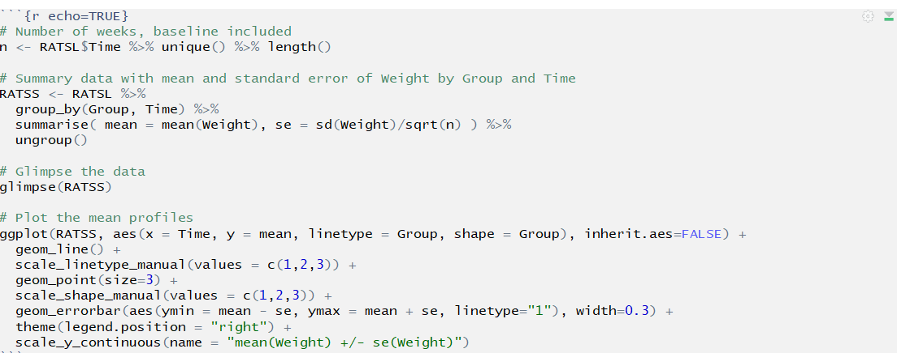
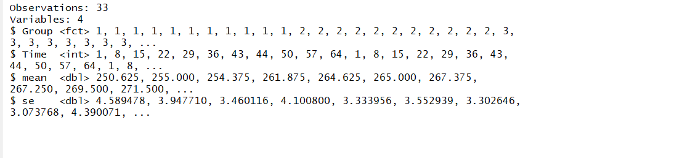
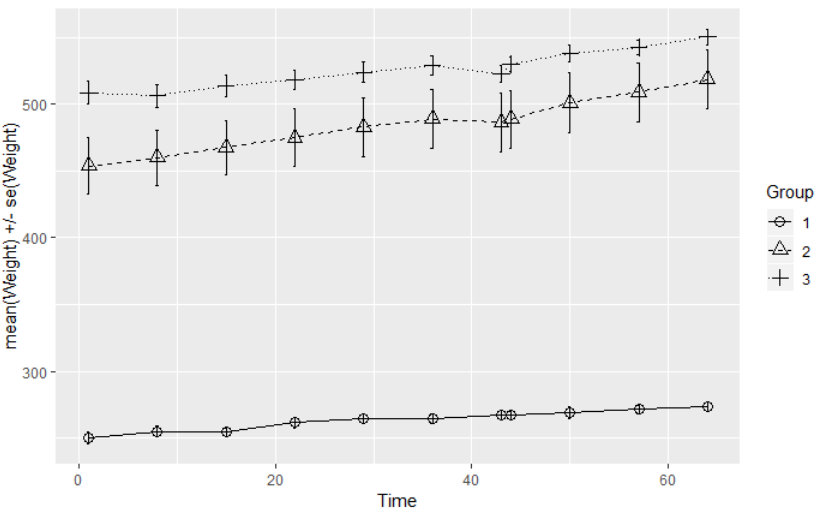
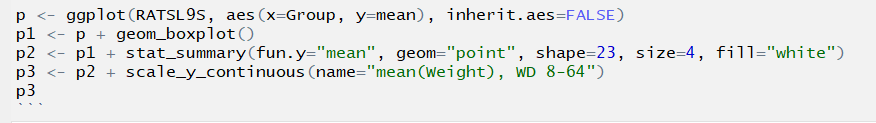
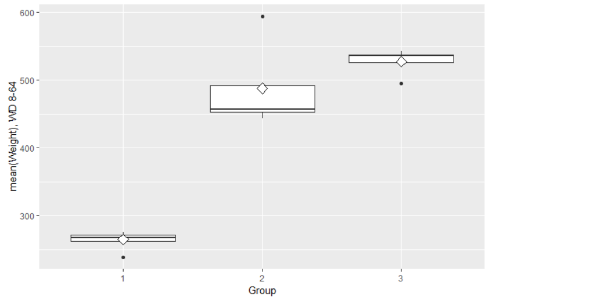
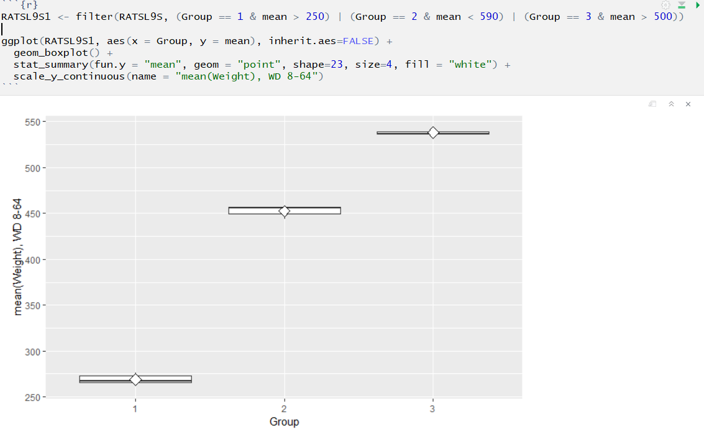
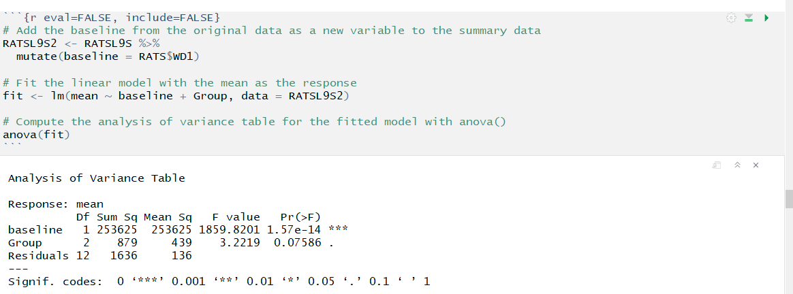

---
output:
  html_document: default
  word_document: default
---

# 6. Analysis of Longitudinal Data

>Hello!!


>Welcome to the last of the weekly analysis entries! This week was interesting. Not only were there some major issues (more on those later), I also thought I'd experiment with the layout of the html some...

This week we will go back to building statistical models. Here is a quote I borrowed from the [course instructions](https://mooc.helsinki.fi/course/view.php?id=158#section-6):

*"The new challenge here is that the data may (and will) include two types of dependencies simultaneously: In addition to the more or less correlated variables that we have faced with all models and methods so far, the observations of the data will also be intercorrelated. Usually (in the above mentioned models and methods), we can (often pretty safely) assume that the observations are independent of each other. However, in longitudinal data this assumption seldom holds, because we have multiple observations or measurements of the same individuals. The concept of repeated measures highlights this phenomenon that is actually quite typical in many applications. Both types of dependencies must be taken into account; otherwise the models will be biased."*

To cope with the type of setting described above, we will be applying **linear mixed effects models**.

Prior to creating this diary entry, I performed some data wrangling on two data sets, BPSR and RATS. Here is some information on the two datasets:

"40 male subjects were randomly assigned to one of two treatment groups and each subject was rated on the brief psychiatric rating scale (BPRS) measured before treatment began (week 0) and then at weekly intervals for eight weeks. The BPRS assesses the level of 18 symptom constructs such as hostility, suspiciousness, hallucinations and grandiosity; each of these is rated from one (not present) to seven (extremely severe). The scale is used to evaluate patients suspected of having schizophrenia" (from DataCamp).

RATS is from a "nutrition study conducted in three groups of rats (Crowder and Hand, 1990). The three groups were put on different diets, and each animal's body weight (grams) was recorded repeatedly (approximately weekly, except in week seven when two recordings were taken) over a 9-week period. The question of most interest is whether the growth profiles of the three groups differ". (p. 22 [here](https://mooc.helsinki.fi/pluginfile.php/29659/course/section/2208/MABS4IODS-Part6.pdf)).

So, let's get to work, shall we!

Just to add interest (and some challenges), this week we are swapping data sets. In practice, this means that instead of conducting Chapter 8 of MABS exercises using the BPSR data we are using RATS. Same with Chapter 9, BPSR instead of RATS.

>Oh, rats!


>Please note that from section 1C onwards I encountered a serious problem with R Markdown. The chapter itself knitted absolutely fine to html, but as I tried to knit my `index.Rmd` file, the knitting failed. After various attempts at fixing the issue, and spending 2 days with it, I had to admit defeat. So, in order to have a chapter to submit at all this week, I have had to disable various code chunks. Where this is the case, I have included a screen shot of my codes and outputs. My apologies for the resultant somewhat messy report this week!

***

## Part 1. Implementing the Analyses of Chapter 8 of MABS Using the RATS Data

Turns out I need to include the code from `meet_and_repeat.R` here in order for the Markdown to knit to html...

```{r}
library(dplyr)
library(tidyr)
RATS <- read.table("https://raw.githubusercontent.com/KimmoVehkalahti/MABS/master/Examples/data/rats.txt", header = TRUE, sep = '\t')

RATS$ID <- factor(RATS$ID)
RATS$Group <- factor(RATS$Group)
RATSL <- RATS %>%
  gather(key = WD, value = Weight, -ID, -Group) %>%
  mutate(WDS = as.integer(substr(WD,3,4))) 
```

### 1A. Individuals on the plot

First, let's look at some graphical representations of the long RATS data.

To begin we shall plot the `Weight` values for all 16 rats, and we will differentiate between the diet groups into which the rats have been placed. These simple graphs make a number of features of the data readily apparent. 

```{r}
#Access the package ggplot2
library(ggplot2)

# Draw the plot
p <- ggplot(RATSL, aes(x = WDS, y = Weight, col = ID))
p1 <- p + geom_line()
p2 <- p1 + scale_linetype_manual(values = rep(1:10, times=4))
p3 <- p2 + facet_grid(. ~ Group, labeller = label_both)
p4 <- p3 + theme(legend.position = "none")
p5 <- p4 + scale_y_continuous(limits = c(min(RATSL$Weight), max(RATSL$Weight)))
p5
```

Inspecting the graphs above, we can see how the rats' weight increases over time in all the different groups. These plots are helpful in visualizing the weight growth profiles of individual rats. As we can see, rats with lower starting body weight have been grouped together, and that group shows the least actual (as opposed to proportional) weight increase.

### 1B. The Golden Standardise

Let's take a look at how our data behaves once we standardize the `Weight`variable. We will perform this by subtracting the relevant mean from the original value and then dividing by the standard deviation. Here's the math for it:

$$standardized(x)=x-\frac{mean(x)}{sd(x)}$$

And here comes the code for the graph:

```{r}
# Standardise the variable Weight
RATSL <- RATSL %>%
  group_by(WDS) %>%
  mutate(stdweight = (Weight - mean(Weight))/sd(Weight) ) %>%
  ungroup()

# Glimpse the data
glimpse(RATSL)


# Plot again with the standardised bprs
ggplot(RATSL, aes(x = WDS, y = stdweight, col = ID)) +
  geom_line() +
  scale_linetype_manual(values = rep(1:10, times=4)) +
  facet_grid(. ~ Group, labeller = label_both) +
  scale_y_continuous(name = "standardized Weight")
```

Interesting results! In `Group 1`, then standardized weights of the rats were much closer to one another at the end of the experiment - see how the lines get closer to each other towards the end?

In `Group 2` we can see all sorts going on. The rats with the lowest standardized weight had a definite increase, while the largest rat had a moderate increase and the medium-sized one's standardized weight declined.

In `Group 3` the weights were closer to one another at the end of the experiment, similarly to `Group 1`.

### 1C. Good things come in Summary graphs

With a fairly large numbers of observations, graphical displays of individual profiles are often of little use and researchers commonly produce graphs showing average (mean) profiles for each group along with some indication of the variation of the observations at each time point, in this case the standard error of mean:

$$se=\frac{sd(x)}{\sqrt{n}}$$

Although in our RATS dataset the number of individuals is much smaller (16) than in the BPRS set (40), we will do this nonetheless.

**Below are the first of the screen prints that became necessary**








```{r eval=FALSE, include=FALSE}
# Number of weeks, baseline included
n <- RATSL$WDS %>% unique() %>% length()

# Summary data with mean and standard error of Weight by Group and WDS 
RATSS <- RATSL %>%
  group_by(Group, WDS) %>%
  summarise( mean = mean(Weight), se = sd(Weight)/sqrt(n) ) %>%
  ungroup()

# Glimpse the data
glimpse(RATSS)

# Plot the mean profiles
ggplot(RATSS, aes(x = WDS, y = mean, col = Group, shape = Group), inherit.aes=FALSE) +
  geom_line() +
  scale_linetype_manual(values = c(1,2,3)) +
  geom_point(size=3) +
  scale_shape_manual(values = c(1,2,3)) +
  geom_errorbar(aes(ymin = mean - se, ymax = mean + se, linetype="1"), width=0.3) +
  theme(legend.position = "right") +
  scale_y_continuous(name = "mean(Weight) +/- se(Weight)")
```

Note that unlike in the BPRS data, there is no overlap in the mean profiles of the three groups. This suggests there is a difference between the three groups in respect to the mean `Weight` values. Little rats remain little rats!

### 1D. Find the outlaw... Outlier!

It is time to find the outlier rat - if there is one! We will look into the post-diet values of RATS. The mean of the 9 weeks of data will be our summary measure. We will first calculate this measure and look at boxplots of the measure for each diet group. 

**In the below code chunk, everything works fine up until the ggplot part, suggesting that that is where the problem lies... However, for the life of me I can NOT figure out why it fails when knitting the index, and not before... So, after the output you will again find my screen prints.**

```{r}
RATSL9S <- RATSL %>%
  filter(WDS > 1) %>%
  group_by(Group, ID) %>%
  summarise(mean=mean(Weight)) %>%
  ungroup()

glimpse(RATSL9S)

```





```{r eval=FALSE, include=FALSE}
# Create a summary data by dietgroup and ID with mean as the summary variable (we will ignore the baseline WD1).
RATSL9S <- RATSL %>%
  filter(WDS > 1) %>%
  group_by(Group, ID) %>%
  summarise( mean=mean(Weight) ) %>%
  ungroup()

# Glimpse the data
glimpse(RATSL9S)

# Draw a boxplot of the mean versus Group
ggplot(RATSL9S, aes(x = Group, y = mean), inherit.aes=FALSE) +
  geom_boxplot() +
  stat_summary(fun.y = "mean", geom = "point", shape=23, size=4, fill = "white") +
  scale_y_continuous(name = "mean(Weight), WD 8-64")
```

The group that shows us the most interesting results here is `Group 2`. The mean is on the very edge of the box, and the distribution is very skewed. The second  group also shows us that one outlier (outlaw rat!), near the 600 gram mark. Both `Group 1` and `Group 3` also show a single outlier. Let's remove those pesky rodents...

**And again, an unfortunate screenprint coming your way...**



```{r eval=FALSE, include=FALSE}
RATSL9S1 <- filter(RATSL9S, (Group == 1 & mean > 250) | (Group == 2 & mean < 590) | (Group == 3 & mean > 500))

ggplot(RATSL9S1, aes(x = Group, y = mean), inherit.aes=FALSE) +
  geom_boxplot() +
  stat_summary(fun.y = "mean", geom = "point", shape=23, size=4, fill = "white") +
  scale_y_continuous(name = "mean(Weight), WD 8-64")
```

Excluding the outliers changes the box plots quite significantly, especially for `Group 2`. The boxes being so short means that the standardized weights of the rats in each group are very close to one another.

### 1E. T for test and A for Anova

The next step that we will carry out is a more formal test to assess the differences between the diet groups. This is where a t-test would come in, if we were working on the BPSR data. The t-test is appropriate when there are two group means. For a comparison of more than two group means (as in RATS) the one-way analysis of variance (ANOVA) is the appropriate method instead of the t-test.

The baseline measurements of the outcome are often correlated with the summary measure in longitudinal study. We will include the `baseline` in the analysis, that is the starting `Weight` of the rats on `WD1`.

**As I had to disable the code chunk above, the code that would normally appear below, cannot recognize `RATSL9S`, so I've had to disable the one below also... More screenprints!**



```{r eval=FALSE, include=FALSE}
# Add the baseline from the original data as a new variable to the summary data
RATSL9S2 <- RATSL9S %>%
  mutate(baseline = RATS$WD1)

# Fit the linear model with the mean as the response 
fit <- lm(mean ~ baseline + Group, data = RATSL9S2)

# Compute the analysis of variance table for the fitted model with anova()
anova(fit)
```


When we look at the `baseline`, the significance is great.But here we can also see that the variable `Group` achieves the 95% confidence interval, meaning that the diet group that the rats belong in is significant.

>Did I already say "Ah, rats!"? Well, we can say that again! The Index file knitting issue remains a mystery. Let's hope we have more luck with the second part...

***

## Part 2. Implementing the Analyses of Chapter 9 of MABS Using the BPRS Data

We will start with the code from `meet_and_repeat.R` again...

```{r}
BPRS <- read.table("https://raw.githubusercontent.com/KimmoVehkalahti/MABS/master/Examples/data/BPRS.txt", sep  =" ", header = T)
BPRS$treatment <- factor(BPRS$treatment)
BPRS$subject <- factor(BPRS$subject)
BPRSL <-  BPRS %>% gather(key = weeks, value = bprs, -treatment, -subject)
BPRSL <-  BPRSL %>% mutate(week = as.integer(substr(weeks,5,5)))
```


### 2A. Plot first, ask questions later

Let's begin by plotting the data and identifying the observations in each treatment group.

```{r}
# Plot the BPRSL data
ggplot(BPRSL, aes(x = week, y = bprs, group = subject)) +
  geom_line(aes(col = treatment)) +
  scale_linetype_manual(values = rep(1:10, times=4)) +
  facet_grid(. ~ treatment, labeller = label_both) +
  theme(legend.position = "none") + 
  scale_y_continuous(limits = c(min(BPRSL$bprs), max(BPRSL$bprs)))
```

Here we can see all the individuals in each treatment group, and how their `bprs` score behaves throughout the weeks. In the DataCamp exercise (for RATS data), the different groups were all presented in the same graph. However, that does not work with our `BPRS` data as there are so many subjects. Hence the two separate graphs for the two `treatment` groups. We can see that, for the most part, the `bprs` scores are declining throughout the weeks, indicating that the treatments are at least somewhat effective. Another observation of interest here is that especially within the `treatment 1` group, the scores tend to converge towards the end of the treatment weeks. As is the case so often, though, there are exceptions to the rule: we can observe two subjects in each group whose `bprs` scores start increasing before the treatment weeks are over.

### 2B. Holding on to independence: The Linear model

To begin this analysis, we will ignore some home truths! We will pretend that all of the data observations are independent of one another, and ignore the fact that 18 `bprs` scores come from the same subject. We have a data set consisting of 360 observations that can easily be analyzed using linear regression.

In this section, we will fit a linear regression model. The response variable is `bprs` and the explanatory variables are `week` and `treatment`. 

```{r}
# create a regression model BPRS_reg
BPRS_reg <- lm(bprs ~ week + treatment, data = BPRSL)

# print out a summary of the model
summary(BPRS_reg)

```

The summary table above shows the results from fitting a linear regression model with the `bprs` score as the response variable and `treatment` and `week` as the explanatory variables. This model ignores the repeated-measures structure of the data.

In this summary, a worthwhile observation is the significance of the regression `week`. Also, conditional on `week`, treatment group 2 differs from treatment group 1. 

So, what does a graphical representation of the above data look like?

```{r}
p1 <- ggplot(BPRS_reg, aes(x = week, y = bprs, col = treatment))  
p2 <- p1 + geom_point()  
p3 <- p2 + geom_smooth(method = "lm")
p3
```

According to this graph, the `bprs` scores of treatment group 1 start higher and decline faster throughout the weeks than the scores of the subjects in group 2. This indicates that the treatment that the subjects receive in group 1 is more effective.

### 2C. The Random Intercept Model

The model that we created in the previous step assumed that the weekly `bprs` scores are independent of one another. However, this is highly unlikely. Now we will move onto looking at some more appropriate models and graphical representations of our data.

We will fit a random intercept model of the `bprs` score data using `week` and `treatment` as the explanatory variables. This enables the linear regression fit for each subject to differ in *intercept* from the other subjects.

The package we will use is `lme4`. It offers some handy tools for linear and generalized linear mixed-effects models. We will be using the now-familiar ~ operator and also the vertical bar for distinguishing random-effects terms.

```{r message=FALSE, error=FALSE}
# access library lme4
library(lme4)

# Create a random intercept model
BPRS_ref <- lmer(bprs ~ week + treatment + (1 | subject), data = BPRSL, REML = FALSE)

# Print the summary of the model
summary(BPRS_ref)
```

The standard deviation of the subject is 6.885.

### 2D. Slippery slopes: Random Intercept and Random Slope Model

Now we will fit a random intercept and random slope model to the bprs scores data. This will allow the linear regression fits for each individual to differ in not only intercept but also in slope. This will make it possible to account for the differences in the subjects' bprs scores and also the effects of time. 

```{r}
# create a random intercept and random slope model
BPRS_ref1 <- lmer(bprs ~ week + treatment + (week | subject), data = BPRSL, REML = FALSE)

# print a summary of the model
summary(BPRS_ref1)

# perform an ANOVA test on the two models
anova(BPRS_ref1, BPRS_ref)

```

The chi-squared statistic of the likelihood ratio test between `BPRS_ref` and `BPRS_ref` is within the 95% level of significance, indicating a good fit for the model.

### 2E. Time to interact: Random Intercept and Random Slope Model with interaction

Now for the final part: fitting a random intercept and slope model that allows for a treatment group x time interaction.

```{r message=FALSE, error=FALSE}
# create a random intercept and random slope model
BPRS_ref2 <- lmer(bprs ~ week * treatment + (week | subject), data = BPRSL, REML = FALSE)

# print a summary of the model
summary(BPRS_ref2)

# perform an ANOVA test on the two models
anova(BPRS_ref2, BPRS_ref1)

# draw the plot of BPRSL
ggplot(BPRSL, aes(x = week, y = bprs, linetype = subject)) +
  geom_line(aes(col = treatment)) +
  scale_linetype_manual(values = rep(1:10, times=4)) +
  facet_grid(. ~ treatment, labeller = label_both) +
  theme(legend.position = "none") + 
  scale_y_continuous(limits = c(min(BPRSL$bprs), max(BPRSL$bprs)))

# Create a vector of the fitted values
Fitted <- fitted(BPRS_ref2)

# Create a new column fitted to BPRSL
BPRSL <- BPRSL %>%
  mutate(Fitted)

# draw the plot of BPRSL
ggplot(BPRSL, aes(x = week, y = Fitted, linetype = subject)) +
  geom_line(aes(col = treatment)) +
  scale_linetype_manual(values = rep(1:10, times=4)) +
  facet_grid(. ~ treatment, labeller = label_both) +
  theme(legend.position = "none") + 
  scale_y_continuous(limits = c(min(BPRSL$bprs), max(BPRSL$bprs)))
```

Here it is worth noting that the first two graphs are the same as before, and it shows the subjects whose scores started climbing back up before the treatment weeks were over.

The `ANOVA` test on the two models `BPRS_ref1` and `BPRS_ref` tells us that the chi-squared value is 3.1712, and the p-value tells us that the fit against the comparison model is within the 95% significance level. This indicates a good fit.

Next we created a vector of the fitted values of the model with the function `fitted()` and added this new vector as a column in `BPRSL`. Then we used these fitted values to draw a new plot of `BPRSL`. 

The second set of graphs are interesting. They show us the *fitted* values of the `bprs` scores. These graphics underline the fact that the interaction model does not fit the observed data *quite* as well as it did with the RATS data. 

Looking at the graphs of the fitted values, it appears that the slope of declining `bprs` scores is more acute in the first treatment group, indicating that the first form of treatment was more effective. Out of curiosity, I tried to find out what the treatments were that the subjects received in the two groups, but unfortunately this information was not readily available anywhere. While looking, I did manage to find a pdf of the Davis 2002 book, "Statistical Methods for the Analysis of Repeated Measurements". If you're interested in learning more about methods for repeated measurements (i.e. longitudinal data), I recommend taking a look at this volume.

>Again, thanks for reading to the end. Sadly, this was the last of the weekly exercises. I hope you've enjoyed yourself as much as I have!

***


***